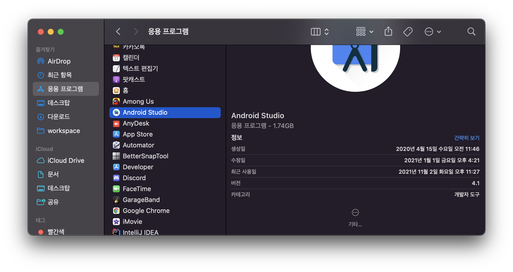

# Context

- 번역해보면 문맥, 맥락 등으로 나온다.
- 오늘날의 IT에선 프로그램의 메모리 영역, 레지스터 값 등의 리소스 등을 지칭한다.

# Android Context



위 사진처럼 Application에 대한 정보가 담겨있다.

Context를 상속받는 컴포넌트들은 모두
`getPackageName(), getResource(), getSystemService()` 등 앱의 정보를 얻을 수 있는 함수 호출이 가능하며,
앱의 리소스, DB, shared preference 등에 접근하기 위해 사용한다.

또한, Application, Service, Activity는 wrapping된 context를 가지고 있다.

> 잘 구현이된 라이브러리에는 백그라운드 작업에 activity의 context를 넘기더라도,
context.getApplicationContext()로 변경된 코드를 볼 수 있다.
이는 해당 context가 activity의 생명주기에 따라 **생성 및 소멸** 되기 때문에(밑에서 추가 설명)
activity가 destroy() 되더라도, 메모리 누수가 발생하는 일을 방지하기 위함이다.

# 그렇다면 언제 상황에 알맞게 context를 사용해야할까?

먼저 위에서 언급했던 세가지 컴포넌트 별로 context 차이점을 구분해볼 필요가있다.

- Application Context
  - 싱글톤 패턴으로 어플리케이션 생명주기를 따른다.
  - ContextWrapper를 상속받고 있다.
  - 액티비티, 서비스의 스코프(생명주기)의 범주를 벗어날 경우에 사용할것(백그라운드 작업)
- Activity Context
  - 액티비티의 생명주기에 따라 자동으로 생성 및 소멸된다.
  - 서비스, Application과 다르게 ContextThemeWrapper를 먼저 상속받고있다.
  - UI, View 작업과 관련했을때만 사용해야한다.
- Service Context
  - 내부적으로는 Application Context와 같이 ContextWrapper를 상속 받고있지만, 차이점은 서비스의 생명주기를 따른다는 점이다.
    
# Application Context 및 Service Context에서 startActivity를 하면 어떻게될까?

밑의 코드로 시나리오를 만들어보자.

```
class MainActivity : AppCompatActivity() {
    override fun onCreate(savedInstanceState: Bundle?) {
        super.onCreate(savedInstanceState)
        setContentView(R.layout.activity_main)

        startService(Intent(this, MyService::class.java))
    }
}
```

```
class MyService : Service() {

    override fun onBind(intent: Intent): IBinder? {
        return null
    }

    override fun onCreate() {
        super.onCreate()

        startActivity(Intent(this, SubActivity::class.java))
    }
}
```

위 MyService context는 activity가 아니기 때문에 task에 쌓을 수 없어서 앱이 죽는다.
때문에 우리는 intent에 flag를 추가해줌으로 task에 새로운 액티비티를 쌓을 수 있도록 해야한다.

```
// 이렇게 하면 된다
class MyService : Service() {

    override fun onBind(intent: Intent): IBinder? {
        return null
    }

    override fun onCreate() {
        super.onCreate()

        startActivity(
            Intent(this, SubActivity::class.java).addFlags(Intent.FLAG_ACTIVITY_NEW_TASK)
        )
    }
}
```

# 참조문헌 References

- [사냥일지 블로그](https://bearhunter49.tistory.com/8)
- [찰스의 안드로이드](https://www.charlezz.com/?p=1080)