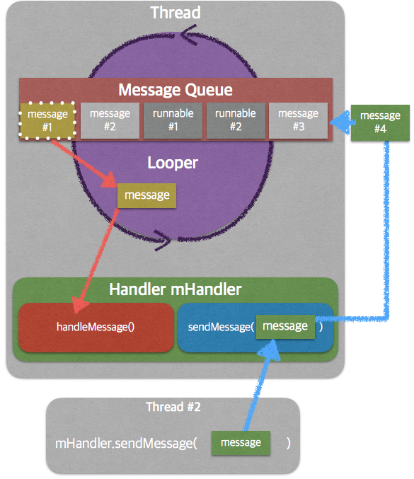
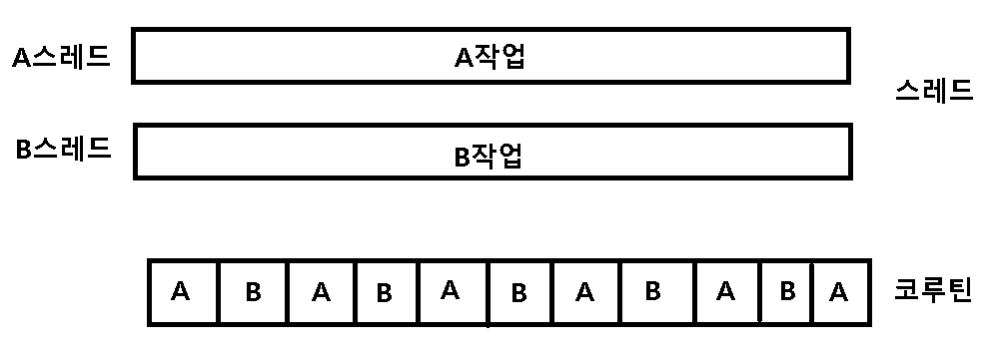

### 비동기 작업 처리 방식

- Thread, ~~AsyncTask~~(Deprecated), Coroutine

### Process

- 앱은 하나의 Process 내에서 작동한다.
- Process는 독립적인 메모리 공간을 부여받아 코드를 실행시키는 Thread와 이 메모리 공간을 공유
- Multi Thread 환경이라면 여러 Thread가 이 Process의 메모리를 공유


- 앱이 Process를 시작하고 최초로 갖는 Thread가 MainThread (=UIThread)
    - 안드로이드 애플리케이션을 시작하면 시스템은 메인 액티비티를 메모리로 올려 프로세스로 만들며, 이 때 메인 스레드가 자동으로 생성된다.
    - 안드로이드 UI는 오직 UIThread에서만 접근할 수 있고, 이 MainThread를 블럭하여 UI 갱신을 막아서는 안된다. ⇒ 작업에 시간이 오래 걸려 UI 갱신을 막는 작업은 MainThread가 아닌 다른 Thread에서 실행하는 것이 좋다.
    - 다른 스레드에서 UIThread에 접근하는 방법 : `Activity.runOnUiThread(Runnable)`, `View.post(Runnable)`, `View.postDelayed(Runnable, long)`
- 이외에 새롭게 생성하는 Thread는 WorkerThread

### Thread(class) / Runnable(interface)

- Thread를 생성하는 방법은 ①`Thread()` 생성자로 만들어서 내부적으로 run()을 구현하는 방법, ②`Thread(Runnable runnable)` 생성자로 만들어 Runnable 인터페이스를 구현한 객체를 생성해 전달하는 방법, 두 가지가 있다.

```kotlin
val textView = findViewById<TextView>(R.id.tv)

// ①Thread()
private val thread = object : Thread() {
    override fun run() {
        super.run()
        val text = Integer.parseInt(textView.text.toString())
        val message = mHandler.obtainMessage().apply {
            data = Bundle().apply { putInt("text", text+1) }
        }
        mHandler.sendMessage(message)
    }
}

// ②Thread(Runnable runnable)
private val runnableThread = Thread(Runnable {
    val text = Integer.parseInt(textView.text.toString())
    textView.post(Runnable {
        textView.text = (text+1).toString()
    })
})

thread.start()
runnableThread.start()
```

- ②번 방법은 Runnable로 Thread의 run() 메소드를 분리한 것이다. (Runnable은 인터페이스이므로 run() 추상 메소드를 반드시 구현해야 한다.)
- 위의 두가지 Thread 생성 방법은 자바 다중 상속과 관계 있다. Thread는 class, Runnable은 interface이므로 때에 따라 다르게 실행되어야 하는 비동기 처리가 있다면 Runnable을 생성자로 넘겨주는게 좋을 것 같다.
- Thread의 start() 메소드를 호출하여 비동기 작업 시작 : start()로 스레드를 시작하면 run()이 호출된다.
- start() 메소드를 실행하면 Process의 메모리와 CPU를 Thread의 스케쥴러가 할당해주고 실행된다.

### Looper와 Message/MessageQueue

- Thread 별로 Looper를 가질 수 있다.
- 실행중인 Thread와 MessageQueue 인스턴스를 멤버변수로 갖는다.
- MainThread는 기본적으로 Looper를 가지며 그 안에 MessageQue가 포함되어 있다.
- 이외에 새로 생성하는 Thread는 기본적으로 Looper를 가지는 것은 아니며, run() 메소드만 실행 후 종료한다. ( ⇒ 때문에 Message를 받을 수 없다. 이를 보완하기 위해 HandlerThread 생김. 밑에서 설명.)
    - 새로운 Thread의 Looper를 생성하기 위해서는 Looper.prepare()로 생성해주고 Looper.loop() 메소드를 통해 Looper가 Message 전달을 기다리고 처리하도록 loop을 실행해줘야 한다. 그리고 이 Looper는 역할이 끝난 지점에서 quit()/quitSafely() 메소드로 중단해 Looper의 실행을 종료해줘야 한다.
- 하나의 Thread에 있는 Looper는 여러개의 Handler를 가질 수 있다.
- MessageQueue에 전달된 Message가 있는지 Looper가 계속 loop 돌면서 확인
- Queue에 Message가 있으면 처리 하고, 없으면 wait() 하다가 Message가 들어오면 notify()를 호출해 다시 구동 / exit()을 만나기 전까지 wait()과  notify()를 반복해서 loop을 돈다.
- Message가 있다면 Handler 인스턴스에 Message 전달(Message 인스턴스 내부에 Handler 지정되어 있음)

### Message와 Runnable(interface)

- Message란 Thread 간 통신할 내용을 담는 객체이자, Queue에 들어갈 일감의 단위로, Handler를 통해 얻고(`Handler.obtainMessage()` ⇒ 이렇게 하는 이유는 안드로이드 시스템에서 만든 MessagePool의 객체를 재사용하기 위함. 새 Message 객체를 생성하는 것보다 효율적. 반환한 Message는 Handler 인자를 담고 있음), 보낼 수 있다(`Handler.sendMessage(Message)`).
- Message는 int, Object 같이 Thread 간 **통신할 내용**을 담는다면, Runnable은 실행할 run() 메소드와 그 내부에서 **실행될 코드**를 담는다는 차이점이 있다.
- Message를 주고받으면 정확한 대상 UI업데이트를 위해 Message를 구별하기 위한 상수(what)를 지정하고 Handler의 handleMessage()에서 상수 값에 따른 처리를 조건문으로 구별해야 하는데, Runnable로 실행할 코드를 바로 담아 넘기면 이런 처리가 필요없다.

### Handler

- Message/Runnable을 핸들링 하기 위한 클래스 ⇒ Looper로부터 받은 Message를 실행/처리하거나, 다른 스레드로부터 Message를 받아 MessageQueue에 넣는 역할
- Handler 인스턴스를 생성하면 Handler는 Looper와 MessageQueue를 자신의 멤버변수 mLooper, mQueue에 할당 후 사용한다. ⇒ Handler는 하나의 Thread와 해당 스레드의 MessageQueue에 종속된다.
- 다른 Thread에서 특정 Thread에 Message를 전달하기 위해서는 해당 Thread에 속한 Handler에 Message를 전달하면 된다. ⇒ MainThread에 Message를 전달하려면(UI 업데이트 등) Handler 생성시 Looper.getMainLooper로 MainThread의 Looper를 인자로 Handler를 생성해서 Message 전달
- 전달받은 Message를 처리하기 위한 `handleMessage()` 메소드 제공 ⇒ 이 메소드를 구현해서 어떤 식으로 처리할지 정의
- MessageQueue에 Message를 전달하는 `sendMessage()`, Runnable을 전달하는 `post(Runnable r)` 메소드 제공
- 하나의 Thread는 여러개의 Handler와 연결 가능

### Thread, Looper, Handler 작동 방식



### HandlerThread

- Thread를 확장한 클래스로, Looper를 기본으로 내장하지 않는 Thread와 달리 Looper를 내장하고 있어 해당 스레드의 Looper를 가진 Handler를 생성할 수 있고, 따라서 Message를 받고 처리할 수 있다.

### 비동기 작업에서 Thread와 Coroutine의 차이



- 코루틴도 하나의 스레드에서 실행된다.
- 여러개의 코루틴을 하나의 스레드에 지정하여 실행할 수 있지만 동시에 실행하는 것은 불가능하고, 한 번에 하나의 코루틴만 실행할 수 있다.
- 그 이유는 코루틴은 스레드 내에서 실행되고 중단지점(suspension point)에 도달하자마자 스레드를 떠나 대기중인 다른 코루틴을 선택할 수 있도록 해방하기 때문이다.
- ⇒ 스레드와 메모리 사용량이 줄어들어 많은 동시성 작업을 수행할 수 있게 된다.
- Thread는 여러 스레드를 사용해서 여러 개의 작업을 **병렬**로 수행하며 비동기적으로 작업
- Coroutine은 여러 개의 작업을 잘게 쪼개서 나눠서 비동기 작업을 수행
- Thread는 생성 과정에서 메모리를 할당하고 해제 하는 부분의 비용이 든다.

참조)

- [https://nsinc.tistory.com/179](https://nsinc.tistory.com/179)
- [https://velog.io/@dlrmwl15/안드로이드-스레드Thread와-핸들러Handler](https://velog.io/@dlrmwl15/%EC%95%88%EB%93%9C%EB%A1%9C%EC%9D%B4%EB%93%9C-%EC%8A%A4%EB%A0%88%EB%93%9CThread%EC%99%80-%ED%95%B8%EB%93%A4%EB%9F%ACHandler)
- [https://50billion-dollars.tistory.com/entry/Android-스레드와-핸들러](https://50billion-dollars.tistory.com/entry/Android-%EC%8A%A4%EB%A0%88%EB%93%9C%EC%99%80-%ED%95%B8%EB%93%A4%EB%9F%AC)
- [https://academy.realm.io/kr/posts/android-thread-looper-handler/](https://academy.realm.io/kr/posts/android-thread-looper-handler/)

Thread와 Coroutine 비교

- [https://angangmoddi.tistory.com/224](https://angangmoddi.tistory.com/224)
- [https://www.charlezz.com/?p=44634](https://www.charlezz.com/?p=44634)